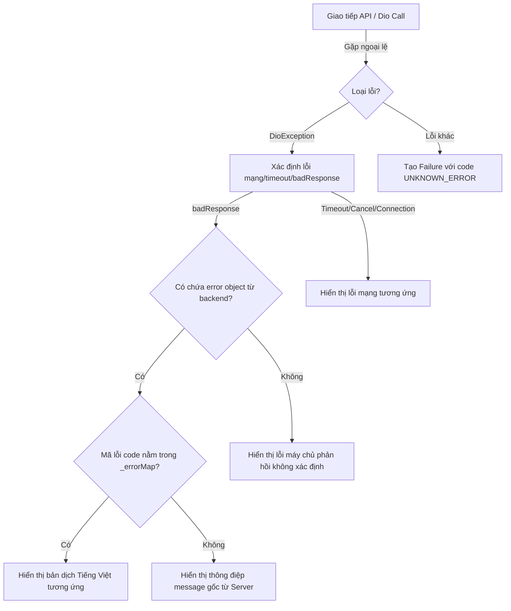
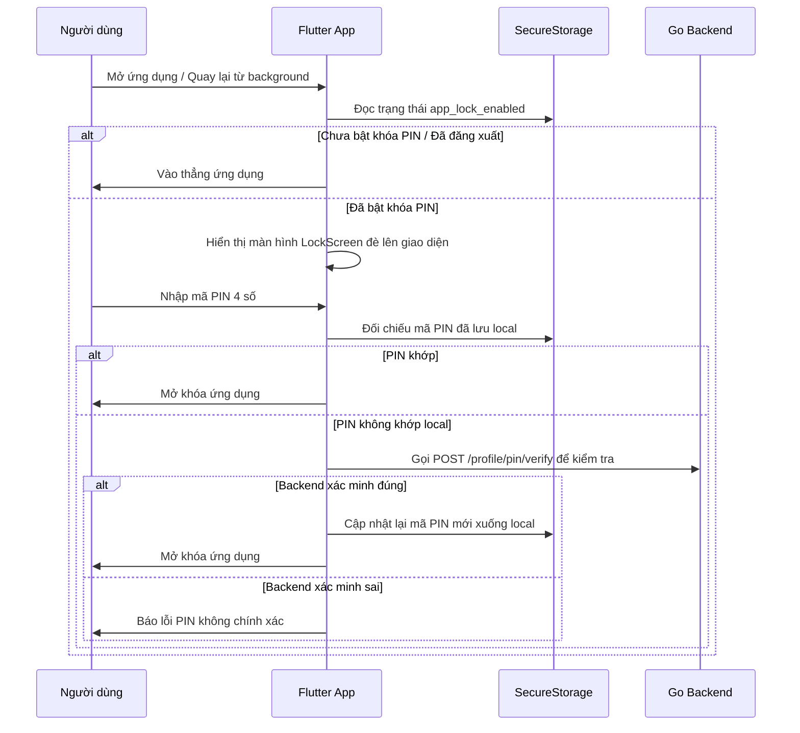

# 📱 Expense Management - Flutter Frontend

Dự án Frontend của ứng dụng quản lý chi tiêu cá nhân được phát triển bằng Flutter. Ứng dụng cung cấp giao diện hiện đại, mượt mà và tối ưu hóa cho trải nghiệm người dùng trên cả hai nền tảng Android và iOS.

---

## 🚀 Các Tính Năng Nổi Bật

- **Quản lý Tài chính Toàn diện**:
  - Quản lý Ví tiền (Wallets) & Ngân sách chi tiêu (Budgets).
  - Quản lý Mục tiêu tiết kiệm (Goals) & Giao dịch định kỳ (Recurring Transactions).
  - Phân loại danh mục thu chi (Categories).
- **Bảo mật & Xác thực**:
  - Đăng nhập/Đăng ký linh hoạt: Email/Mật khẩu, Đăng nhập bằng Google (OAuth) và OTP qua Số điện thoại.
  - **Khóa PIN ứng dụng (App Lock)**: Thiết lập mã PIN 4 chữ số và xác thực sinh trắc học (Vân tay / Face ID).
  - **Khôi phục PIN bảo mật**: Cho phép khôi phục mã PIN thông qua Câu hỏi bảo mật (Security Questions) được đồng bộ hóa với Backend.
  - **Bảo vệ Đăng xuất**: Yêu cầu nhập đúng mã PIN hiện tại trước khi thực hiện đăng xuất.
- **Trải nghiệm Người dùng cao cấp**:
  - Hỗ trợ chế độ Sáng/Tối (Light/Dark Mode) tự động theo hệ thống.
  - Đa ngôn ngữ (Localization) với Tiếng Việt và Tiếng Anh.
  - Giao diện sử dụng font chữ cao cấp **Google Sans Flex**.
  - 🔮 **Premium Liquid Glass UI System**: Hệ thống giao diện Kính lỏng đẳng cấp mang hơi hướng tương lai, kết hợp sức mạnh của Shader khúc xạ ánh sáng và mô phỏng Vật lý thời gian thực (Spring Physics):
    - 🧊 **[AppLiquidGlass](docs/app_liquid_glass_guide.md)**: Container nền tảng xử lý khúc xạ quang học, đổ bóng và làm mờ Gaussian. Tích hợp thuật toán tối ưu hoá GPU (Auto-tuning) khi chuyển trang.
    - 🕹️ **[AppLiquidGlassButton](docs/app_liquid_glass_button_guide.md)**: Nút bấm tương tác vật lý. Cho phép người dùng kéo giãn, biến dạng (Squash & Stretch) bề mặt kính và nảy lên đàn hồi chân thực.
    - 🪄 **[AppLiquidGlassMenu](docs/app_liquid_glass_menu_guide.md)**: Context Menu tràn viền với tính năng độc quyền **Vuốt 1 chạm liền mạch (Global Seamless Drag)**. Mọi thao tác nhấn giữ, kéo chọn và thả tay diễn ra mượt mà không độ trễ.
    - 🎚️ **[AppLiquidGlassSwitch](docs/app_liquid_glass_switch_guide.md)**: Công tắc thủy tinh tối giản, tự động chuyển sắc theo Dark/Light Theme kèm rung phản hồi xúc giác (Haptics).
    - 📚 *Tham khảo [Tài liệu Kiến trúc Liquid Glass](docs/liquid_glass_guide.md)*

---

## 🛠️ Công Nghệ Sử Dụng

- **Core**: Flutter SDK, Dart Language.
- **State Management**: Flutter BLoC (Cubit & Bloc) quản lý trạng thái độc lập và logic rõ ràng.
- **Dependency Injection**: `get_it` làm Service Locator để tự động tiêm (inject) và quản lý vòng đời của các dependency (Client, Services, DataSources, Repositories, UseCases, Blocs).
- **Navigation & Routing**: GoRouter giúp quản lý định tuyến luồng màn hình.
- **Lưu trữ dữ liệu nhạy cảm**: Flutter Secure Storage (lưu trữ mã PIN, Auth token an toàn) & SharedPreferences.
- **Network Client**: Dio HTTP Client hỗ trợ Interceptors tự động đính kèm JWT và làm mới token (Refresh Token rotation).
- **Biometric**: `local_auth` tích hợp FaceID/Fingerprint.
- **Database Backend**: Kết nối song song với Cloud Firestore và Go RESTful API.

---

## 📁 Cấu Trúc Thư Mục Dự Án (Clean Architecture - Feature First)

Dự án được tổ chức chặt chẽ theo kiến trúc **Clean Architecture (Feature-First)** (Trường phái ResoCoder) chia mỗi tính năng thành 3 Layer độc lập để dễ bảo trì, kiểm thử và mở rộng:

```text
lib/
├── core/                       # Các cấu hình dùng chung của toàn app
│   ├── constants/              # Các hằng số cấu hình (Firebase, API URL,...)
│   ├── localization/           # Quản lý đa ngôn ngữ (LocaleCubit)
│   ├── network/                # ApiClient cấu hình Dio & Interceptors
│   ├── routing/                # Cấu hình GoRouter định tuyến màn hình
│   ├── theme/                  # Định nghĩa màu sắc (AppColors) và chủ đề app
│   └── utils/                  # Các helper class (AuthTokenManager,...)
├── features/                   # Các module tính năng của hệ thống
│   ├── [feature_name]/         # Module từng tính năng (ví dụ: auth, wallets, app_lock,...)
│   │   ├── data/               # Layer Dữ liệu: models, datasources, repositories impl
│   │   │   ├── datasources/    # Remote/Local DataSources gọi API hoặc lưu local
│   │   │   ├── models/         # Các Data Models ánh xạ từ JSON/Firestore
│   │   │   └── repositories/   # Triển khai thực tế của Repository Interface
│   │   ├── domain/             # Layer Nghiệp vụ (Enterprise logic): entities, usecases, repo interfaces
│   │   │   ├── entities/       # Các đối tượng nghiệp vụ thuần túy
│   │   │   ├── repositories/   # Giao diện (interface) trừu tượng của Repository
│   │   │   └── usecases/       # Các UseCases thực thi một nghiệp vụ đơn lẻ
│   │   └── presentation/       # Layer Hiển thị: BLoCs, Screens, Widgets
│   │       ├── bloc/           # Các BLoC quản lý trạng thái màn hình
│   │       ├── screens/        # Giao diện các màn hình chính
│   │       └── widgets/        # Các UI component nội bộ dùng cho màn hình
├── injection.dart              # Quản lý Dependency Injection toàn cục với get_it
├── l10n/                       # Định nghĩa file dịch ngôn ngữ (*.arb)
├── shared/                     # Các widget và cấu hình dùng chung toàn dự án
└── main.dart                   # Khởi chạy ứng dụng (gọi initInjection & thiết lập MultiBlocProvider)
```

---

## 🛡️ Xử lý Lỗi Tập trung (Centralized Error Handling)

Ứng dụng sử dụng một hệ thống xử lý lỗi tập trung để chuyển đổi tất cả các ngoại lệ từ HTTP Client (`Dio`) và các ngoại lệ khác thành đối tượng `Failure` chuẩn hóa:

- **`Failure`**: Class đại diện cho lỗi trong ứng dụng, chứa `message` thân thiện với người dùng, `code` định danh lỗi và `statusCode` HTTP (nếu có).
- **`ErrorHandler`**: Bộ phân tích lỗi tập trung. Khi nhận được một `DioException` dạng `badResponse`, nó sẽ tự động phân tích cấu trúc lỗi JSON gửi về từ Go Backend `{ "error": { "code": "...", "message": "..." } }`:
  - Đối chiếu mã `code` với bảng ánh xạ lỗi (`_errorMap`) để hiển thị thông báo Tiếng Việt phù hợp với ngữ cảnh người dùng.
  - Nếu mã lỗi không nằm trong danh mục định nghĩa trước, ứng dụng sẽ hiển thị thông điệp `message` gốc nhận được từ Server hoặc thông báo lỗi chung.

### Sơ đồ xử lý lỗi:



---

## 💻 Hướng Dẫn Cài Đặt & Chạy Thử

### Yêu cầu hệ thống:
- [Flutter SDK](https://docs.flutter.dev/get-started/install) mới nhất.
- Android Studio / VS Code đã cài plugin Flutter & Dart.
- Thiết bị ảo (Emulator) hoặc thiết bị thật kết nối qua USB.

### Các bước cài đặt:

1. **Tải các dependencies cần thiết**:
   ```bash
   flutter pub get
   ```

2. **Cấu hình Biến môi trường**:
   - Copy file mẫu [config.json.example](file:///home/quan/Documents/expense_management/config.json.example) thành `config.json`:
     ```bash
     cp config.json.example config.json
     ```
   - Chỉnh sửa `API_BASE_URL` và `GOOGLE_WEB_CLIENT_ID` theo môi trường của bạn. File `config.json` đã được thêm vào `.gitignore` để bảo vệ thông tin bảo mật.

3. **Chạy ứng dụng**:
   * **Qua VS Code (F5)**: Dự án đã được cấu hình sẵn trong file [.vscode/launch.json](file:///home/quan/Documents/expense_management/.vscode/launch.json) để tự động nạp `config.json`. Bạn chỉ cần nhấn phím **F5** để Debug/Run bình thường.
   * **Qua Terminal**:
     ```bash
     flutter run --dart-define-from-file=config.json
     ```

---

## 🔒 Quy trình hoạt động của Mã PIN bảo mật


