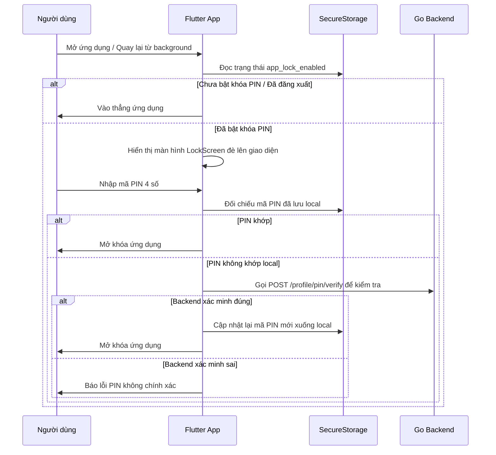

# 📱 Expense Management - Flutter Frontend

Dự án Frontend của ứng dụng quản lý chi tiêu cá nhân được phát triển bằng Flutter. Ứng dụng cung cấp giao diện hiện đại, mượt mà và tối ưu hóa cho trải nghiệm người dùng trên cả hai nền tảng Android và iOS.

---

## 🚀 Các Tính Năng Nổi Bật

- **Quản lý Tài chính Toàn diện**:
  - Quản lý Ví tiền (Wallets) & Ngân sách chi tiêu (Budgets).
  - Quản lý Mục tiêu tiết kiệm (Goals) & Giao dịch định kỳ (Recurring Transactions).
  - Phân loại danh mục thu chi (Categories).
- **Bảo mật & Xác thực**:
  - Đăng nhập/Đăng ký linh hoạt: Email/Mật khẩu, Đăng nhập bằng Google (OAuth) và OTP qua Số điện thoại.
  - **Khóa PIN ứng dụng (App Lock)**: Thiết lập mã PIN 4 chữ số và xác thực sinh trắc học (Vân tay / Face ID).
  - **Khôi phục PIN bảo mật**: Cho phép khôi phục mã PIN thông qua Câu hỏi bảo mật (Security Questions) được đồng bộ hóa với Backend.
  - **Bảo vệ Đăng xuất**: Yêu cầu nhập đúng mã PIN hiện tại trước khi thực hiện đăng xuất.
- **Trải nghiệm Người dùng cao cấp**:
  - Hỗ trợ chế độ Sáng/Tối (Light/Dark Mode) tự động theo hệ thống.
  - Đa ngôn ngữ (Localization) với Tiếng Việt và Tiếng Anh.
  - Giao diện sử dụng font chữ cao cấp **Google Sans Flex**.

---

## 🛠️ Công Nghệ Sử Dụng

- **Core**: Flutter SDK, Dart Language.
- **State Management**: Flutter BLoC (Cubit & Bloc) cho việc quản lý trạng thái sạch sẽ và dễ kiểm thử.
- **Navigation & Routing**: GoRouter giúp quản lý các luồng màn hình rõ ràng.
- **Lưu trữ dữ liệu nhạy cảm**: Flutter Secure Storage (lưu trữ mã PIN, Auth token an toàn) & SharedPreferences.
- **Network Client**: Dio CLI hỗ trợ Interceptors tự động đính kèm JWT và tự động làm mới token.
- **Biometric**: `local_auth` để tích hợp FaceID/Fingerprint.
- **Database Backend**: Kết nối song song với Cloud Firestore và Go RESTful API.

---

## 📁 Cấu Trúc Thư Mục Dự Án (Feature-First Architecture)

Dự án được tổ chức theo kiến trúc **Feature-First** để dễ dàng mở rộng và bảo trì:

```text
lib/
├── core/                       # Các cấu hình dùng chung của toàn app
│   ├── constants/              # Các hằng số cấu hình (Firebase, API URL,...)
│   ├── localization/           # Quản lý đa ngôn ngữ (LocaleCubit)
│   ├── network/                # ApiClient cấu hình Dio & Interceptors
│   ├── routing/                # Cấu hình GoRouter định tuyến màn hình
│   ├── theme/                  # Định nghĩa màu sắc (AppColors) và chủ đề app
│   └── utils/                  # Các helper class (AuthTokenManager,...)
├── features/                   # Các module tính năng của hệ thống
│   ├── app_lock/               # Module khóa PIN ứng dụng & Biometrics
│   │   ├── data/services/      # Tương tác với SecureStorage & Backend API
│   │   └── presentation/       # UI LockScreen, PinRecovery và AppLockBloc
│   ├── auth/                   # Module Xác thực (Login, Register, OTP, Google)
│   ├── budgets/                # Module Quản lý ngân sách chi tiêu
│   ├── categories/             # Module Quản lý danh mục thu chi
│   ├── settings/               # Module Hồ sơ cá nhân (ProfileScreen, EditProfile)
│   └── wallets/                # Module Quản lý ví tài chính
├── l10n/                       # Định nghĩa file dịch ngôn ngữ (*.arb)
├── shared/                     # Các widget và utils tái sử dụng toàn dự án
│   └── widgets/                # AppText, AppButton, AppTextInput,...
└── main.dart                   # File khởi chạy ứng dụng
```

---

## 💻 Hướng Dẫn Cài Đặt & Chạy Thử

### Yêu cầu hệ thống:
- [Flutter SDK](https://docs.flutter.dev/get-started/install) mới nhất.
- Android Studio / VS Code đã cài plugin Flutter & Dart.
- Thiết bị ảo (Emulator) hoặc thiết bị thật kết nối qua USB.

### Các bước cài đặt:

1. **Tải các dependencies cần thiết**:
   ```bash
   flutter pub get
   ```

2. **Cấu hình Biến môi trường**:
   - Copy file mẫu [config.json.example](file:///home/quan/Documents/expense_management/config.json.example) thành `config.json`:
     ```bash
     cp config.json.example config.json
     ```
   - Chỉnh sửa `API_BASE_URL` và `GOOGLE_WEB_CLIENT_ID` theo môi trường của bạn. File `config.json` đã được thêm vào `.gitignore` để bảo vệ thông tin bảo mật.

3. **Chạy ứng dụng**:
   * **Qua VS Code (F5)**: Dự án đã được cấu hình sẵn trong file [.vscode/launch.json](file:///home/quan/Documents/expense_management/.vscode/launch.json) để tự động nạp `config.json`. Bạn chỉ cần nhấn phím **F5** để Debug/Run bình thường.
   * **Qua Terminal**:
     ```bash
     flutter run --dart-define-from-file=config.json
     ```

---

## 🔒 Quy trình hoạt động của Mã PIN bảo mật


